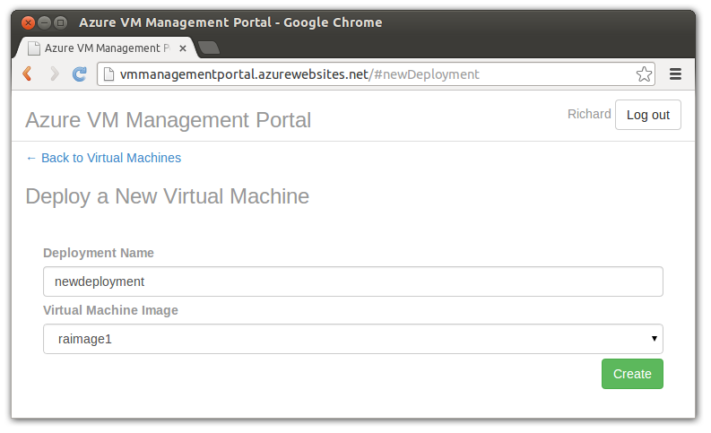

# Azure VM Management Portal




A cut-down portal for non-technical users to create, start, stop and delete Virtual Machine instances.

Perfect for your training or sales teams to create and tear down machines, without having access to the whole Azure Portal.

Run in Azure Websites.

Uses Azure Active Directory to authenticate users, so you can synchronize it with your local domain.


## Installation

__1) Clone this repository__

```
$ git clone https://github.com/richorama/azure-vm-management-portal.git

```

__2) Download your publish settings file__ from [here](http://go.microsoft.com/fwlink/?LinkId=254432) and save it as `accounts.publishsettings`, overwriting the existing file.

__3) Create a Web Site in Azure__ (using the command below, or through the portal)

```
$ azure site create --git
```

__4) Update the `settings.json` file__ 

* Set the `realm` and `logoutUrl` settings to the web site address (i.e. `http://YOURADDRESS.azurewebsites.net/`)

__5) Create an Active Directory in Azure__

* Add yourself as a user of the domain
* Add a new application to the Active Directory (an application my organization is developing)
* For the sign in url and App ID URI, add the azure web site address (`http://YOURADDRESS.azurewebsites.net/`)
* Once created, click on the 'App Endpoints' button, and copy the URLs for 'FEDERATION METADATA DOCUMENT' and 'WS-FEDERATION SIGN-ON ENDPOINT' update the `settings.json` file, and set the `identityMetadata` and `identityProviderUrl` settings respectively.
* Go to the 'configure' tab, and set the REPLY URL to `http://YOURADDRESS.azurewebsites.net/login/callback`

__6) Create a Storage Account__

* Once created click on 'Manage Access Keys' and copy the values for 'STORAGE ACCOUNT NAME' and 'PRIMARY ACCESS KEY' and update the `settings.json` file, and set the 'StorageAccount' and 'StorageKey' settings respectively

__7) Create a SendGrid account__

* Update the `MailUsername`, `MailPassword` and `MailFrom` settings in `settings.json` with the values from SendGrid

__8) Commit the changes made to the settings files, and push the code to Azure__

```
$ git commit -am "updated settings"
$ git push azure master
```

## License

MIT